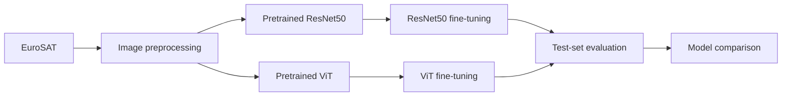
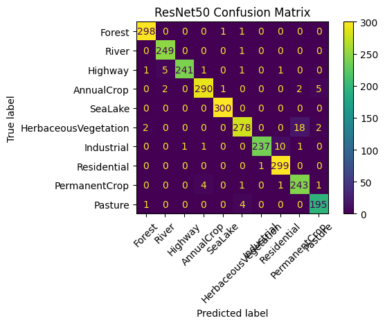

# EuroSAT Land Cover Classification: ResNet50 vs ViT

Fine-tuning and comparing two pretrained architectures for satellite land-cover classification.

## Project Overview

This project compares a convolutional neural network (ResNet50) and a Vision Transformer (ViT) on the EuroSAT satellite image dataset. Both models use pretrained weights and are fine-tuned end to end on the same train, validation, and test splits. ViT achieved the strongest test accuracy and macro F1 in this experiment, while ResNet50 completed fine-tuning substantially faster.

## Key Results

| Model | Test Accuracy | Macro F1 | Training Time |
|---|---:|---:|---:|
| ResNet50 | 97.4074% | 97.3584% | **11.44 min** |
| **ViT Base Patch16-224** | **98.7037%** | **98.6658%** | 42.19 min |


**Best-performing model: ViT Base Patch16-224.** It improved test accuracy by approximately 1.30 percentage points in this EuroSAT experiment. These results are specific to this dataset, split, and fine-tuning setup; they do not imply that ViT is universally better than ResNet50.

ViT achieved the best accuracy in this experiment, while ResNet50 required much less training time and used a smaller model. The better choice therefore depends on whether accuracy or computational efficiency is the higher priority.

## Dataset

[EuroSAT](https://github.com/phelber/EuroSAT) contains Sentinel-2 satellite imagery labeled for land-cover classification. This experiment uses the [`cm93/eurosat`](https://huggingface.co/datasets/cm93/eurosat) version from the Hugging Face Hub.

- **27,000** RGB images
- **10** land-cover classes
- **21,600** training images
- **2,700** validation images
- **2,700** test images

The classes are AnnualCrop, Forest, HerbaceousVegetation, Highway, Industrial, Pasture, PermanentCrop, Residential, River, and SeaLake. Because class frequencies vary, macro F1 is reported alongside accuracy.

## Approach

Both models were fine-tuned and evaluated on the same EuroSAT data splits.



## Fine-Tuning Setup

### ResNet50

- Torchvision pretrained ImageNet weights (`ResNet50_Weights.DEFAULT`)
- Final fully connected layer replaced with a 10-class classifier
- Full end-to-end fine-tuning
- AdamW optimizer
- Learning rate: `1e-4`
- Epochs: `3`

### Vision Transformer

- Base checkpoint: [`google/vit-base-patch16-224`](https://huggingface.co/google/vit-base-patch16-224)
- Pretrained weights with the classification head adapted to 10 classes
- Full end-to-end fine-tuning
- Hugging Face Trainer
- Learning rate: `5e-5`
- Weight decay: `0.01`
- Epochs: `3`
- Best checkpoint selected by validation macro F1

## Evaluation

The models were evaluated on the held-out 2,700-image test split using:

- Accuracy
- Macro F1
- Per-class precision, recall, and F1
- Confusion matrices

The notebook retains the complete classification reports, comparison table, and confusion matrices for both models.

## Results and Error Analysis

ResNet50's most difficult classes included `HerbaceousVegetation` and `PermanentCrop`, both with a per-class F1 of 0.95. ViT reduced these errors overall, although `PermanentCrop` remained one of its more difficult classes, with a per-class F1 of 0.97.

### Model complexity

| Model | Trainable parameters | Approx. FP32 weight footprint |
|---|---:|---:|
| ResNet50 with 10-class head | ~23.53M | ~89.8 MiB |
| ViT Base Patch16-224 with 10-class head | ~85.81M | ~327.3 MiB |

These figures are derived from the model architectures after replacing their original classification heads. The footprint is the theoretical parameter storage at four bytes per FP32 value; actual checkpoint size varies with serialization format and metadata. Inference latency was not benchmarked, so model size and parameter count should not be treated as measured serving speed.

### Confusion matrices

| ResNet50 | ViT Base Patch16-224 |
|---|---|
|  |  |

## Hugging Face Model

The fine-tuned ViT model is available on Hugging Face:

[Haifald/vit-eurosat](https://huggingface.co/Haifald/vit-eurosat)

## Repository Structure

```text
cnn-vs-vit-eurosat/
├── README.md
├── requirements.txt
├── notebooks/
│   └── CNN_vs_ViT_EuroSAT.ipynb
└── assets/
    ├── resnet50-confusion-matrix.png
    └── vit-confusion-matrix.png
```

## How to Run

1. Install the project dependencies:

   ```bash
   pip install -r requirements.txt
   ```

2. Open `notebooks/CNN_vs_ViT_EuroSAT.ipynb` in Jupyter or Google Colab.
3. Run the notebook cells in order. A GPU is recommended for fine-tuning.