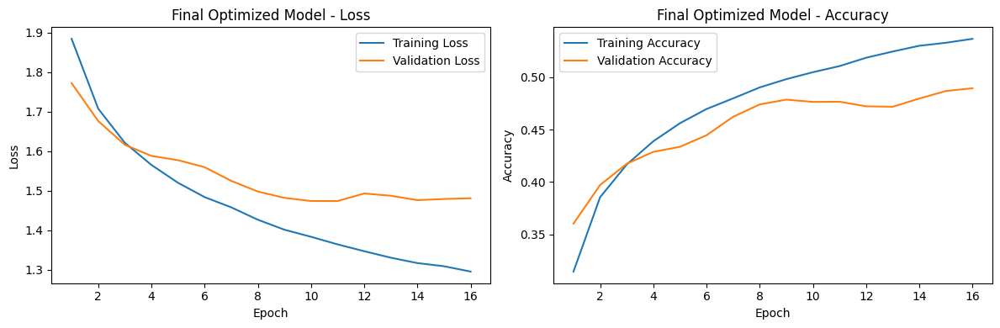
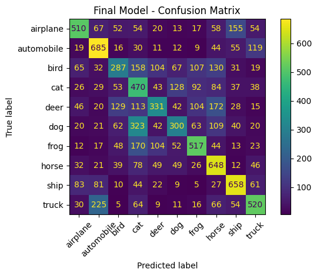
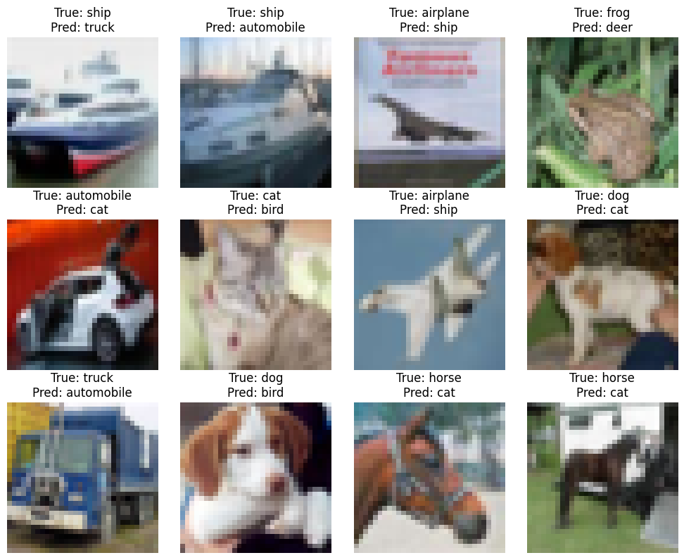
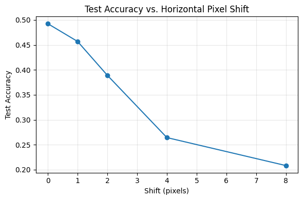

# How Far Can a Dense Neural Network Go on Image Data?

This project investigates how far a fully connected neural network can go on CIFAR-10 when images are flattened into independent pixel features. Through controlled architecture, optimization, and regularization experiments, it examines both what Dense networks can learn and where the loss of spatial structure becomes a fundamental limitation.

**Research question:** How much performance can architecture, optimization, and regularization recover after a 32 × 32 RGB image is flattened into 3,072 features?

## Dataset & Preprocessing

CIFAR-10 contains 60,000 images across 10 classes. A reproducible, stratified split uses 45,000 images for training and 5,000 for validation; the official 10,000-image test set is held out until final evaluation. Pixels are normalized to `[0, 1]`, and each image is flattened into 3,072 input features.

## Experimental Approach

Using a fixed seed (`42`) and shared split, the study compares network depth; diagnoses learning curves; tests optimization and regularization choices; and concludes with an Early Stopping ablation, held-out evaluation, error analysis, and pixel-shift test. The notebook retains the complete experiment-by-experiment evidence.

## Architecture Comparison

| Architecture | Hidden layers | Best validation accuracy |
|---|---:|---:|
| Shallow | 1 × 128 | 46.96% |
| **Medium** | **3 × 128** | **49.52%** |
| Deep | 6 × 128 | 47.42% |

The Medium network performed best. More depth did not automatically improve generalization; the Deep model overfit more strongly.

## Key Tuning Findings

| Experiment | Key finding |
|---|---|
| Architecture | The Medium `3 × 128` network performed best |
| Learning rate | `0.0001` reached the highest peak, while `0.001` converged much faster |
| Optimizer | Adam outperformed SGD |
| Regularization | Dropout and Batch Normalization reduced validation performance |
| Early Stopping | Preserved near-comparable validation performance with much shorter training |

The final configuration retained Adam, learning rate `0.001`, batch size `128`, and Early Stopping as the best balance of validation performance, convergence speed, and overfitting control.

## Final Model & Results

The selected model uses three hidden layers with 128 ReLU units each, a 10-unit Softmax output, Adam, learning rate `0.001`, batch size `128`, and Early Stopping on validation loss. It contains **427,658 trainable parameters**.

| Held-out metric | Result |
|---|---:|
| Test accuracy | **49.26%** |
| Test loss | **1.4421** |
| Macro F1 | **0.4875** |



## Error Analysis

Performance varied substantially by class: ships and automobiles were strongest, while birds were weakest. The confusion matrix shows recurring errors between visually similar classes, including dogs/cats and deer/horses.

<p align="center">
  
  
</p>

## Pixel-Shift Sensitivity

| Horizontal shift | Test accuracy |
|---:|---:|
| 0 px | **49.26%** |
| 2 px | **38.92%** |
| 8 px | **20.83%** |

Labels and object identities remained unchanged; only image position changed. Even a small translation caused a substantial accuracy drop.



## Why CNNs Next?

Flattening preserves pixel values but removes explicit spatial locality. Dense weights are tied to absolute input positions, so the model cannot naturally reuse the same learned feature across locations. The pixel-shift experiment makes this limitation measurable.

This motivates CNNs, where local receptive fields and shared filters preserve spatial structure and allow features to be detected across image positions.

## Repository Structure

```text
cifar10-dense-network/
├── README.md
├── notebooks/
│   └── cifar10_dense_network_experiments.ipynb
└── assets/
```

## How to Run

```bash
python -m venv .venv
# Windows: .venv\Scripts\activate
# macOS/Linux: source .venv/bin/activate
pip install -r ../requirements.txt
jupyter notebook notebooks/cifar10_dense_network_experiments.ipynb
```

The committed notebook includes all recorded outputs and can be reviewed without retraining. A full run retrains every experiment and may take considerable time.

## Tech Stack

Python · TensorFlow/Keras · NumPy · pandas · Matplotlib · scikit-learn · Jupyter
