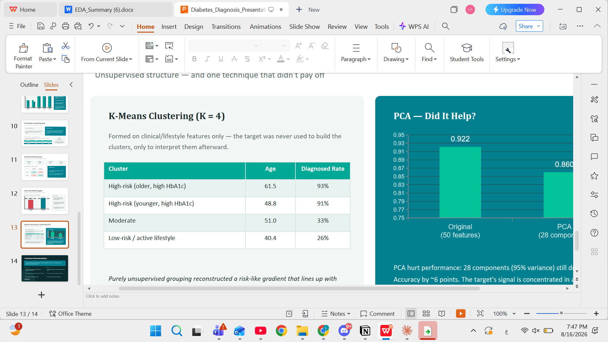
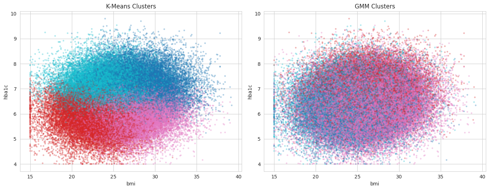

# Diabetes Diagnosis Prediction

An end-to-end machine learning capstone project that predicts whether an individual is diagnosed with diabetes using demographic, lifestyle, risk-history, and clinical screening features.

> 
## Project Overview

Diabetes can remain undetected until complications appear. This project explores whether routine screening data can be used to flag individuals who are likely to have diabetes and may need follow-up clinical testing.

The goal is not to replace diagnosis. The goal is to build a **triage / pre-screening model** that prioritizes catching true positive cases while keeping the workflow leakage-safe and interpretable.

## Key Results

| Item | Result |
|---|---:|
| Dataset size | 100,000 records |
| Target | `diagnosed_diabetes` |
| Best validation model | Gradient Boosting |
| Best validation ROC-AUC | 0.9459 |
| Final test accuracy | 0.8586 |
| Final test F1 | 0.8855 |
| Final test ROC-AUC | 0.9446 |
| Final test recall for diagnosed class | 0.91 |
| Chosen threshold | 0.20 |

The final model used a lower threshold than the default 0.50 because this is a screening context: missing a true diabetes case is more costly than sending a non-diabetic person for follow-up testing.

## Dataset

The dataset contains demographic, lifestyle, risk-history, and clinical screening measurements.

Feature groups include:

- **Demographic and lifestyle:** age, gender, ethnicity, education, income, employment, smoking, alcohol, physical activity, diet, sleep, and screen time.
- **Risk history:** family history of diabetes, hypertension history, and cardiovascular history.
- **Clinical measurements:** BMI, waist-to-hip ratio, blood pressure, cholesterol panel, glucose measurements, insulin, HbA1c, and risk score.

The binary target is:

```text
diagnosed_diabetes = 1  -> diagnosed with diabetes
diagnosed_diabetes = 0  -> not diagnosed
```

## Data Quality and Leakage Handling

The dataset had no missing values and no duplicate rows, but two decisions were important:

1. **Invalid blood pressure rows:** 154 rows where `systolic_bp <= diastolic_bp` were removed as physiologically impossible records.
2. **Leakage prevention:** `diabetes_stage` was removed because it almost directly reveals the target and would make the model unrealistic for pre-screening.

The workflow uses a train / validation / test split before fitting preprocessing steps. Encoding, scaling, and variance filtering are fit on the training set only.

## Modeling Approach

The supervised learning workflow compares five models:

| Model | Family | Purpose |
|---|---|---|
| Logistic Regression | Linear baseline | Interpretable starting point |
| K-Nearest Neighbors | Instance-based | Non-linear comparison |
| Decision Tree | Tree-based | Interpretable non-linear model |
| Random Forest | Bagging ensemble | Reduces tree variance |
| Gradient Boosting | Boosting ensemble | Sequentially corrects previous errors |

Validation comparison after tuning:

| Model | Val Accuracy | Val F1 | Val ROC-AUC |
|---|---:|---:|---:|
| Gradient Boosting | 0.9215 | 0.9300 | 0.9459 |
| Random Forest | 0.9214 | 0.9299 | 0.9441 |
| Decision Tree | 0.9206 | 0.9293 | 0.9452 |
| Logistic Regression | 0.8597 | 0.8843 | 0.9344 |
| KNN | 0.8489 | 0.8732 | 0.9174 |

Gradient Boosting was selected because it achieved the best validation F1 and ROC-AUC with a very small train-validation gap.

## Threshold Tuning

The default threshold of 0.50 produced very high precision but missed more true diabetes cases. A threshold of 0.20 was selected to improve recall.

| Threshold | Precision | Recall | F1 |
|---:|---:|---:|---:|
| 0.50 | 0.9998 | 0.8694 | 0.9300 |
| 0.20 | 0.8631 | 0.9089 | 0.8854 |

This trade-off is appropriate for a screening tool where false negatives are more costly than false positives.

## Error Analysis

False negatives were concentrated near the clinical decision boundary rather than among obvious high-risk cases. Missed positive cases had lower average HbA1c and glucose values than correctly detected positive cases.



## Clustering and PCA

The project also includes unsupervised learning and dimensionality reduction:

- K-Means clustering found patient groups that aligned with different diagnosis rates.
- Gaussian Mixture Modeling was used as a second clustering method.
- PCA retained 95.2% of variance with 28 components, but reduced validation accuracy from 0.9215 to 0.8598.

This suggests that the strongest predictive signal is concentrated in specific clinical features such as HbA1c and glucose, not necessarily in the highest-variance components.



## Repository Structure

```text
diabetes-diagnosis-prediction/
├── README.md
├── requirements.txt
├── .gitignore
├── data/
│   └── diabetes_dataset.csv
├── figures/
│   ├── error_analysis.png
│   └── clustering_pca.png
├── notebooks/
│   └── Diabetes_Diagnosis_Prediction_Capstone.ipynb
└── presentation/
    └── Diabetes-Diagnosis-Presentation.pdf
```

## How to Run

Install the dependencies:

```bash
pip install -r requirements.txt
```

Then open the notebook:

```text
notebooks/Diabetes_Diagnosis_Prediction_Capstone.ipynb
```

Run the notebook from top to bottom.

## Main Limitations

- The dataset appears unusually clean and may not reflect messy real-world clinical data.
- The model depends heavily on lab measurements such as HbA1c and glucose.
- Predictive performance does not prove clinical usefulness.
- External validation on an independent population is required before real-world use.
- This model should support triage decisions only, not replace clinical diagnosis.
